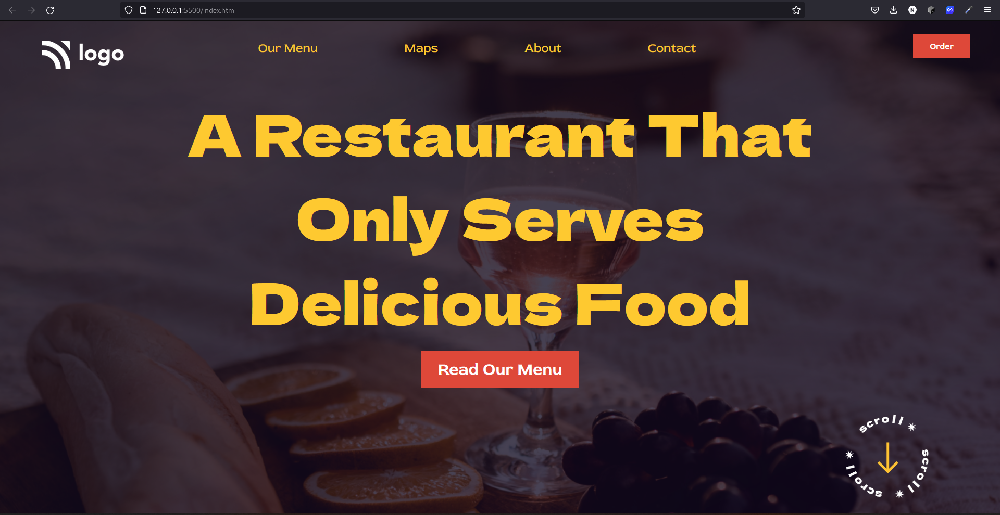

# home_page-restaurant 

# Preview

<!-- about -->
# About
 - Positioned elements with flex box
 - Landing page structure
 - No additional packages for styling

# Links
[Demo](https://restorant-page-o101.netlify.app/)

# Test
- on firefox and chrome
- Windows 100% scaling.

# issues

- Not responsive
